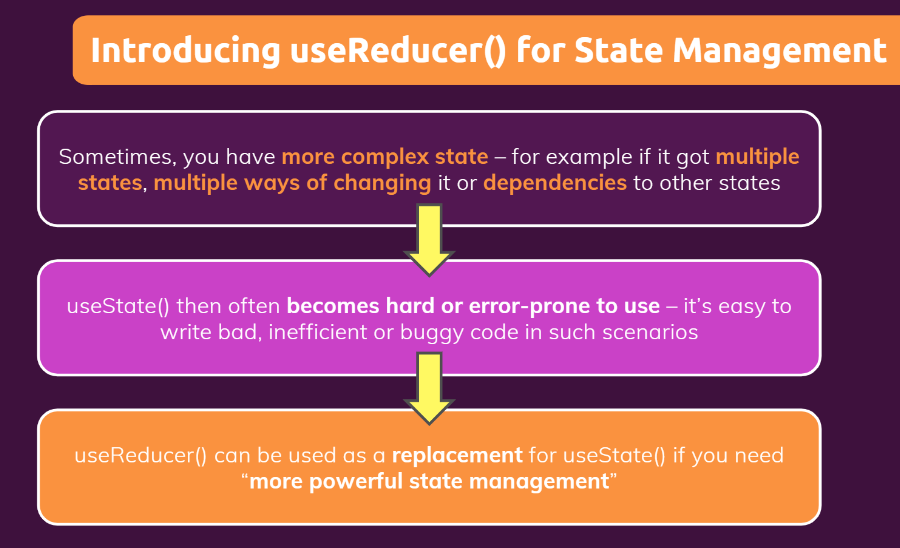
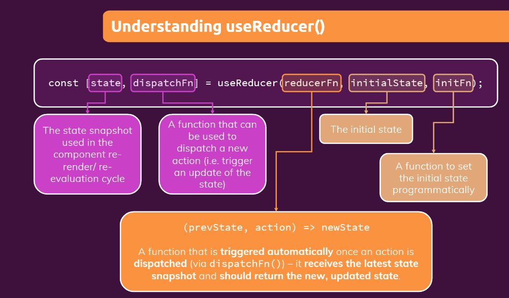

- [Home](https://github.com/pervez8ktt/React)
# Using useReducer() Hook (v-117)

- Why we use **userReducer**?

- [Git Repo](https://github.com/pervez8ktt/06-usereducer-starting-project)







# Steps to use useReducer hook 

#### [Login.js](src/components/Login/Login.js)

- need to import useReducer

 ```js
 import React, { useState, useEffect, useReducer } from 'react';
 ```

 - Initialize resucer function

 ```js

 const Login = (props) => {
  
  const [emailState, dispatchEmail] =  useReducer(emailReducer,{

    value:'',
    isValid:false

});


```

- **emailState**: is the state function which is used in component re-render/re-evelution
- **dispatchEmail**: A function that can be used to dispatch a new action(i.e. trigger an update of the state)
- **emailReducer**: A function that is triggered automatically  once an action is dispatched via dispatch function (dispatchEmail()). It receives the latest state snapshot and should return the new, updated state.
- **Initial Function**: The initial state.

#### Define emailReducer

```js
const emailReducer= (state, action) =>{

  if(action.type==='USER_INPUT'){
    return {

      value:action.val,
      isValid:action.val.includes('@')
  }  
  }

  if(action.type==='INPUT_BLUR'){
    return {

      value:state.value,
      isValid:state.value.includes('@')
  }
  }


  return {

      value:'',
      isValid:false

  }

};
```

- This function define outside the component. Because this function not required any data, which is genereted inside the component function.
- Reducer function always return new Snapshot of state

#### Call dispatch function.

Reducer function automatically executed, once dispatch function called

```js

const emailChangeHandler = (event) => {
    dispatchEmail({type:'USER_INPUT', val: event.target.value});

    
  };
```

```js
const validateEmailHandler = () => {
    dispatchEmail({type:'INPUT_BLUR'});
  };

```

#### use state variable to re-render/re-eveluate component

```js

<input
            type="email"
            id="email"
            value={emailState.value}
            onChange={emailChangeHandler}
            onBlur={validateEmailHandler}
          />

```